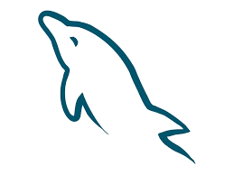
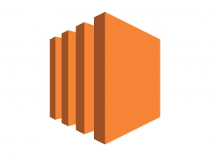
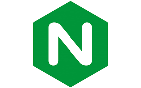
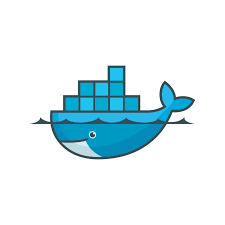
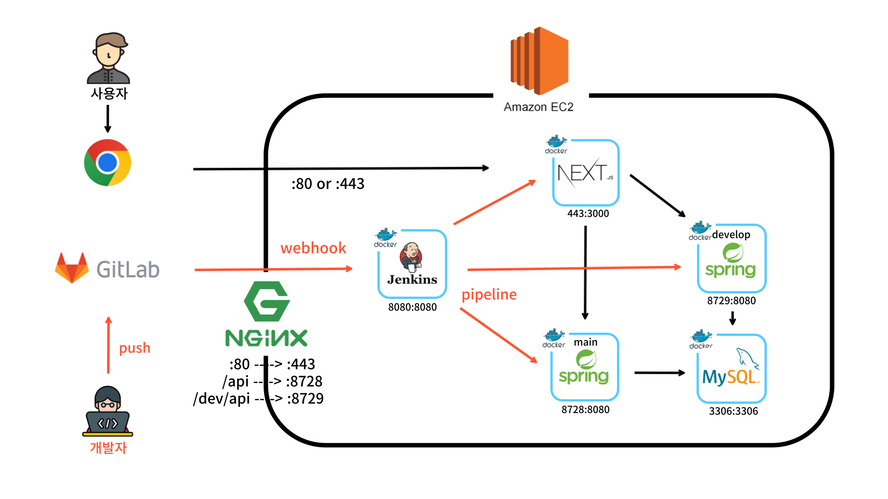
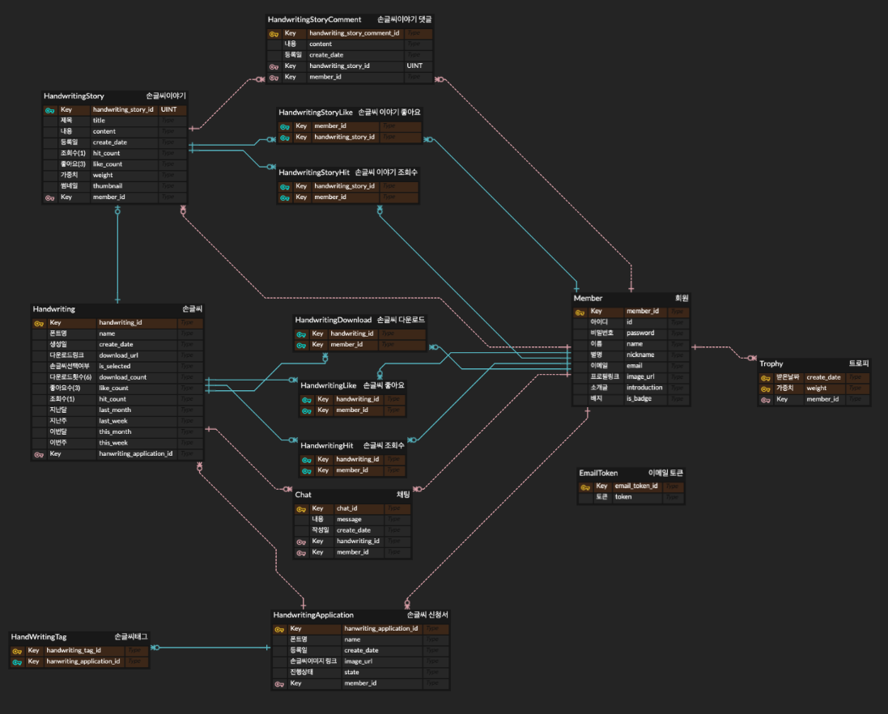
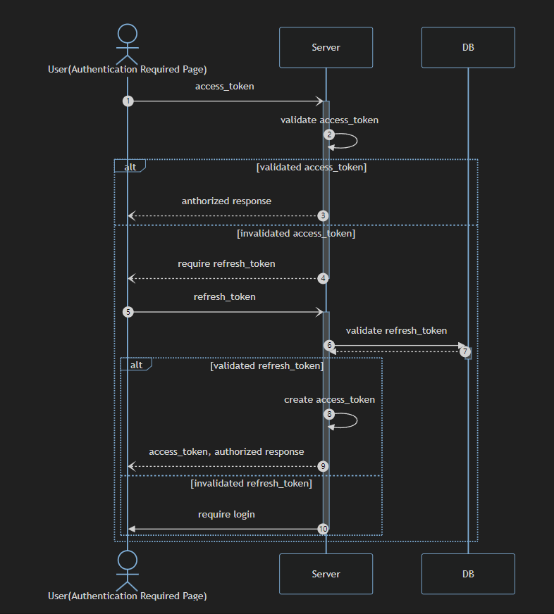
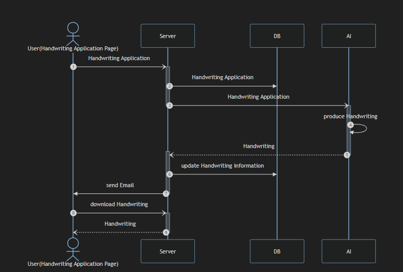
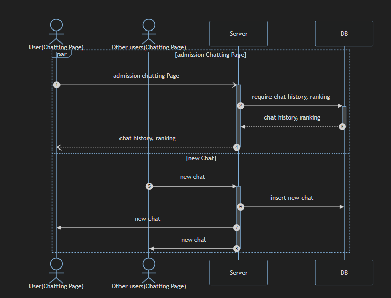

# 소개

### 팀 구성

---

 
 

### 협업

---

 
 
 
 

# 기술 스택

### 프론트앤드

---

 
 

### 백앤드

---

 
 

### 인공지능

---

 
 

### 인프라

---

 
 
 
 

# 아키텍쳐

### 어플리케이션

---

 
 

### ERD

---

 
 

### 시퀀스 다이어그램

---

