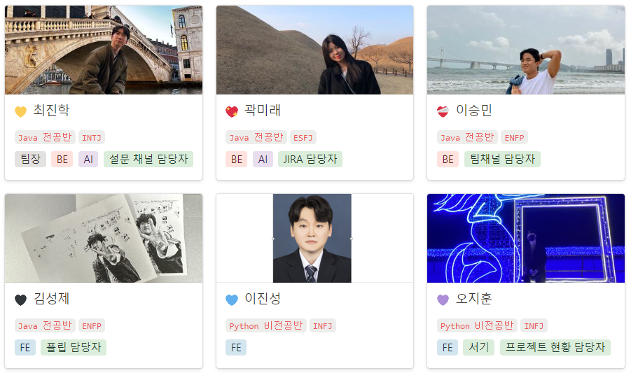
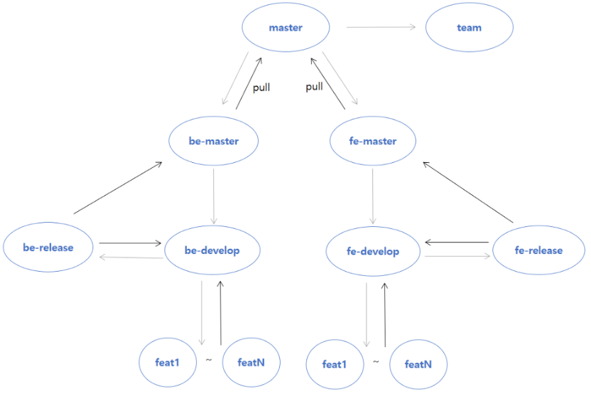
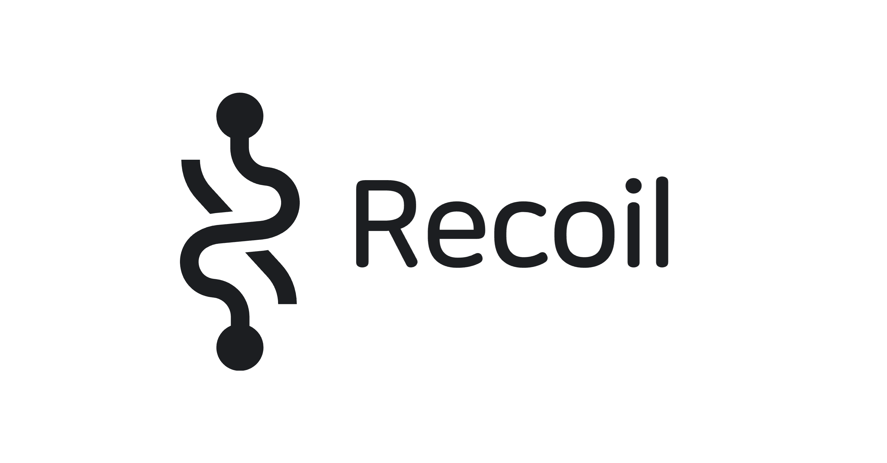
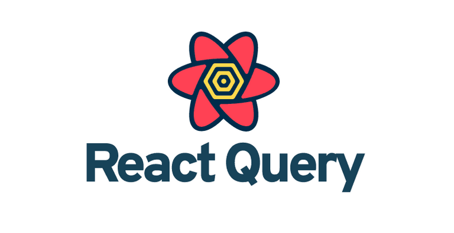

# 소개

### 팀 구성

---

 
 

### 협업

---

- 매주 **스프린트**를 **Jira**를 활용해 관리하였고, **Gerrit**을 활용해 **코드 품질을 관리**하였다.

 
 

### 브랜치 전략

---

- **main(master)**: 서비스을 직접 배포하는 역할을 하는 브랜치
- **feature**: 각 기능 별 개발 브랜치
- **develop**: feature에서 개발된 내용이 저장되는 브랜치
- **release**: 배포를 하기 전 내용을 QA(품질 검사)하기 위한 브랜치
- **hotfix**: main 브랜치로 배포를 하고 나서 버그가 생겼을 때 빨리 고치기 위한 브랜치

---

 
 
 
 

# 기술 스택

### 프론트앤드

---

 
 

### 백앤드

---

 
 

### 인공지능

---

 
 

### 인프라

---

 
 
 
 

# 아키텍쳐

### 어플리케이션

---

 
 

### ERD

---

 
 

### 시퀀스 다이어그램

---

